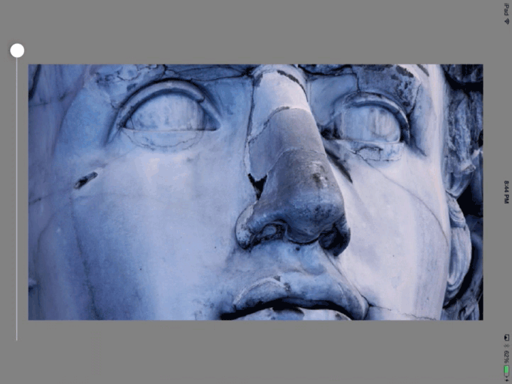

**Note that in this example, blurring/downsampling is happening *per frame* using a CADisplayLink on the main run loop. This can significantly impact FPS at the higher downsample levels. This repo was made for assistance with some real time video work so there ya go.**

Really basic.

This repo simply holds some code to perform downsampling like one might get on various mipmap levels, achieved using a two pass (separable) box blur. Not really planning to do much with this repo, just making it public so I don't have to upgrade my plan right now.

